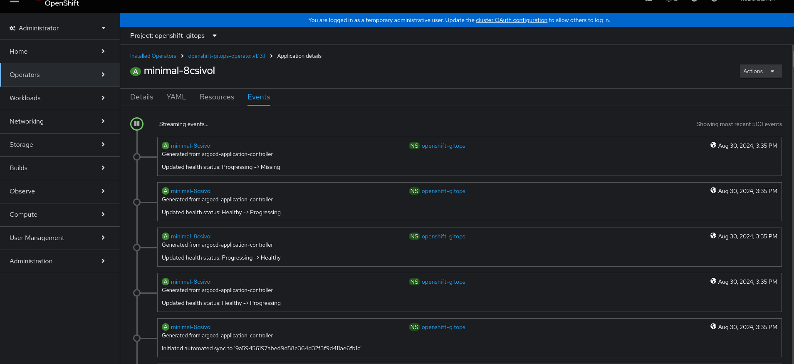

# GitOps (Argo) and OADP (Velero)

### Install the OpenShift gitops operator
ah, you know how :)

### Get the argocli
https://argo-cd.readthedocs.io/en/stable/cli_installation/

### Login
```
ADMIN_PASSWD=$(oc get secret openshift-gitops-cluster -n openshift-gitops -o jsonpath='{.data.admin\.password}' | base64 -d)
```

```
SERVER_URL=$(oc get routes openshift-gitops-server -n openshift-gitops -o jsonpath='{.status.ingress[0].host}')
```
```
argocd login --username admin --password ${ADMIN_PASSWD} ${SERVER_URL}
```

### Get the argocd route or context
```
ARGO_SERVER=`oc get route -n openshift-gitops -o jsonpath='{range .items[1]}{.spec.host}'`
```
* check this by running
```
argo context
```

### Basic Docs
https://docs.openshift.com/gitops/1.12/argocd_applications/creating-an-application-using-gitops-argocd-cli.html

### Sample invocation 
```
argocd app create minimal-8csivol \
  --repo https://github.com/weshayutin/gitops-oadp.git \
  --path app \
  --revision main \
  --dest-namespace minimal-8csivol \
  --directory-recurse \
  --auto-prune \
  --self-heal \
  --sync-policy automated \
  --sync-option CreateNamespace=true \
  --grpc-web \
  --server $ARGO_SERVER  \
  --dest-server  https://kubernetes.default.svc 
```

### Then you have to label the namespace for things to kick off
```
oc label ns minimal-8csivol "argocd.argoproj.io/managed-by=openshift-gitops"
```


## Known Errors with misconfigured Argo 

Argo and OADP need to be configured properly when they are used together in the same cluster and namespace.  Both Argo and OADP assume to have full control over creating and deleting objects and resources in the namespace.

#### A CSI DataMover backup will fail with volumesnapshots not found

  * DataMover Backup
```
velero backup create 8csi-argo1 --include-namespaces minimal-8csivol --snapshot-move-data=true
```
  * Failure - [volumesnapshots not found](known_errors/volumesnapshot_not_found.txt)

#### CSI Backup
```
velero backup create 8csi-argo-csi-1 --include-namespaces minimal-8csivol
```
  * Failures - [volumesnapshots not found](known_errors/csi-backup-volumesnapshot.txt)

#### FSBackup - kopia ( no errors )
```
velero backup create 8csi-argo-fs-kopia-1 --include-namespaces minimal-8csivol  --default-volumes-to-fs-backup=true
```
  * success - [backup details](known_errors/fs_backup_kopia)

#### FSBackup - restic
```
  configuration:
    nodeAgent:
      enable: true
      uploaderType: restic
```
```
velero backup create 8csi-argo-fs-restic-1 --include-namespaces minimal-8csivol  --default-volumes-to-fs-backup=true
```

* success - [backup details](known_errors/fs-backup-restic)

## How to configure Argo to work with OADP

Argo has to be configured to not manage PVC and PV's if OADP is backing up or restoring to the namespace.

* inspect the argocd configuration
```
oc get argocd openshift-gitops -n openshift-gitops -o yaml
```

* edit the config to add the resourceExclusions if needed.

The default config as of OpenShift 4.16 has the following:
```
  resourceExclusions: |
    - apiGroups:
      - tekton.dev
      clusters:
      - '*'
      kinds:
      - TaskRun
      - PipelineRun
```

* update the resource exclusions to include PV's and PVC's.
```
  resourceExclusions: |
    - apiGroups:
      - tekton.dev
      clusters:
      - '*'
      kinds:
      - TaskRun
      - PipelineRun
    - apiGroups:
      clusters:
      - '*'
      kinds:
      - PersistentVolumeClaim
      - PersistentVolumes
      - VolumeSnapshots
      - VolumeSnapshotsContents
```

* Once Argo has been updated the minimal-8csivol namespace can be backed up, deleted and restored.  The label `argocd.argoproj.io/managed-by: openshift-gitops` will
also be restored via OADP and your application will be running, with data and hooked back into Argo Gitops :)

```
argocd app list
NAME                              CLUSTER                         NAMESPACE        PROJECT  STATUS     HEALTH   SYNCPOLICY  CONDITIONS                                             REPO                                           PATH  TARGET
openshift-gitops/minimal-8csivol  https://kubernetes.default.svc  minimal-8csivol  default  OutOfSync  Healthy  Auto-Prune  ExcludedResourceWarning(8),RepeatedResourceWarning(9)  https://github.com/weshayutin/gitops-oadp.git  app   main

```


## Additional changes to the app:
git [update the deployment change](https://github.com/weshayutin/gitops-oadp/commit/25199529bcc6537e95a6d9729bdf223d0b226772971e71e1b899351c2b6478abd)




```
argocd app list --grpc-web
NAME                              CLUSTER                         NAMESPACE        PROJECT  STATUS     HEALTH   SYNCPOLICY  CONDITIONS                  REPO                                           PATH  TARGET
openshift-gitops/minimal-8csivol  https://kubernetes.default.svc  minimal-8csivol  default  OutOfSync  Healthy  Auto-Prune  ExcludedResourceWarning(8)  https://github.com/weshayutin/gitops-oadp.git  app   main

```